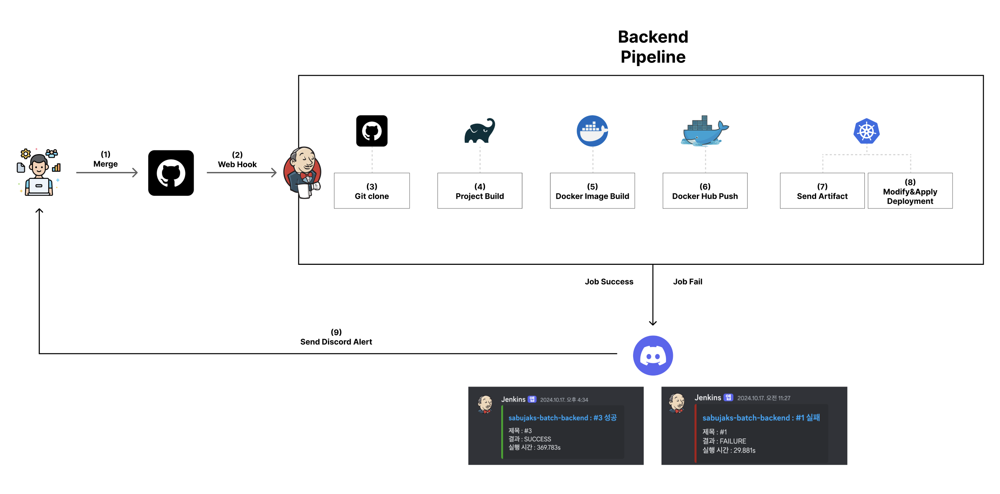
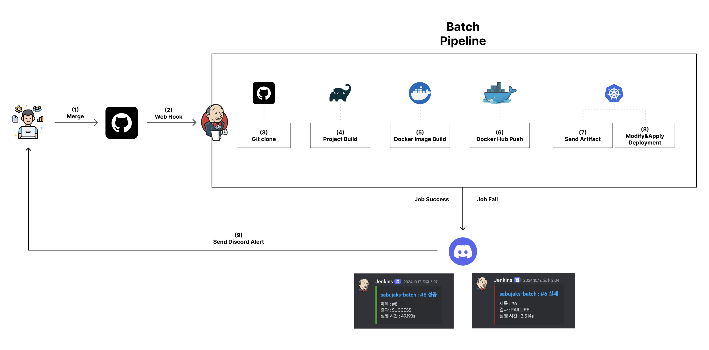
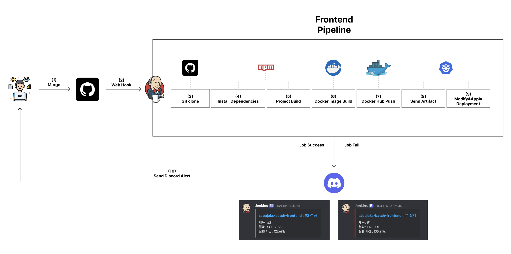
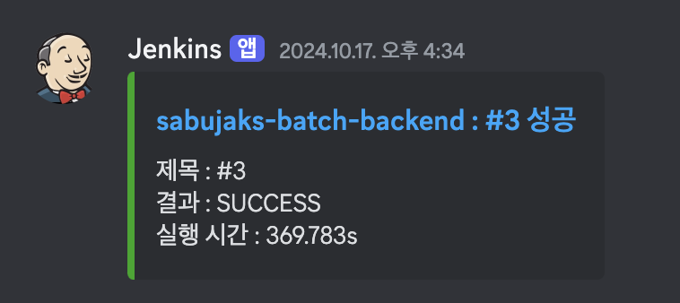
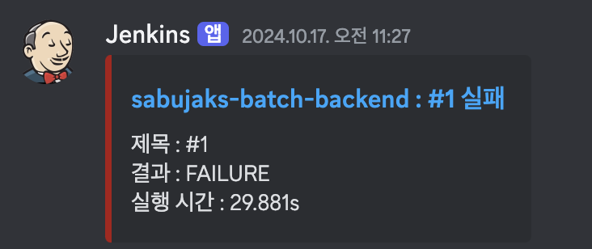

<h1 align="center">통합 채용 시스템  
	IRS (Integration Recruite System) </h1>

  

 

    

## 🤼‍♂️팀원 소개

<table>
  <tr>
    <td>
      
    </td>
    <td>
      
    </td>
    <td>
      
    </td>
    <td>
      
    </td>
  </tr>
  <tr>
    <td align="center">
      <a href="https://github.com/syy0O">구은주</a>
    </td>
    <td align="center">
      <a href="https://github.com/xeunnie">박종성</a>
    </td>
    <td align="center">
      <a href="https://github.com/SihyunSeo">서시현</a>
    </td>
    <td align="center">
      <a href="https://github.com/subi930">서재은</a>
    </td>
  </tr>
</table>

 

## 📌 기술 스택

<!--  -->

 

<!--  -->

 

    

 상세 기술 스택 

- OS : Linux
- Container : Docker v26.0.0
- Orchestration : Kubernetes v1.29.9
- CNI : Calico v3.27.0
- CI/CD : Jenkins v2.473
- Monitoring : Prometheus, Grafana(dashboard_ID - )
- Notification : Discord plugin

 

## 🖥️ IRS 운영 환경

- Linux 기반의 리눅스 가상 머신 5대로 구성된 k8s 클러스터를 구축
- Master Node :1대
- Worker Node :3대
- k8s 클러스터 내부의 Pod 간 통신을 위한 네트워크 플러그인 위해 Calico CNI 설치
- Service 생성시 LoadBalance Type 사용을 위해 Metallb를 설치
- 모니터링 시스템으로 Prometheus와 Grafana 구축
- 같은 네트워크 대역폭을 사용하여 하나의 k8s 클러스터를 구성하기 위해 네트워크 장치로 브릿지를 사용

 

## 🖥️ 모니터링 시스템

- Prometheus와 Grafana를 이용한 모니터링 시스템 구축
- Prometheus는 k8s 클러스터 내부에서 동작하며, istio-proxy 통해 metric 데이터를 수집
- Grafana는 Prometheus의 NodePort 주소로 연동하여 metric 데이터를 시각화
- Grafana 대시보드를 통해 클러스터의 상태를 실시간으로 확인 가능

 

## ✨젠킨스 파이프라인(배포 시나리오)

    

 백엔드 배포 시나리오 

1. 🚀 git push
   - 각 브랜치에서 작업이 끝난 후 PR을 요청하여 dev-batch 브랜치에 push & merge를 진행한다.
2. 🔗 webhook
   - merge가 이뤄지면 40000 포트번호로 포트포워딩 되어 있는 젠킨스 서버로 Webhook이 이뤄진다.
3. 🛠️ Git Clone ~ Project Build
   - 깃허브에서 프로젝트를 clone한 뒤 backend 프로젝트로 이동한다.
   - ./gradlew bootJar를 통해 JAR파일을 생성한다.
4. 📦 Docker Build ~ Docker Push
   - Spring Boot 프로젝트에 포함되어 있는 도커 파일을 바탕으로 docker build를 하여 새로운 버전의 도커 이미지를 생성한다.
   - 생성된 도커 이미지를 docker push 명령어를 통해서 도커 허브에 이미지를 업로드한다.
5. 🚀 Docker Image Push
   - 도커 허브에 이미지를 업로드하게 되면 새로운 버전으로 업로드 된다. ex) sabujaks/backend-api:1.$BUILD_ID
6. ⚙️ Send Artifacts ~ Modify & Apply Deployment
   - 도커 허브에 이미지를 업로드하는 과정이 성공적으로 완료되면 k8s master 노드의 ssh 서버로 접속하여 BUILD_ID에 따른(홀수/짝수) Blue-Green YAML파일을 cicd/k8s/backend폴더에 옮긴다.
   - k8s master 노드로 옮겨진 backend YAML 파일을 kubectl apply 명령어를 통해서 적용시킨다.
7. ⚙️ K8S Deployment Docker Image Update
   - backend YAML 파일이 적용되면 이전에 도커 허브로 올렸던 최신 버전의 도커 이미지를 바탕으로 새로운 Deployment를 생성하고, 기존에 배포중이던 Deployment를 중지한다.
8. 💬 Send Discord Alert
   - 앞선 모든 과정에서 성공 및 실패할 시 Discord 알림을 보낸다.

    

 배치 배포 시나리오 

1. 🚀 git push
   - 각 브랜치에서 작업이 끝난 후 PR을 요청하여 dev-batch 브랜치에 push & merge를 진행한다.
2. 🔗 webhook
   - merge가 이뤄지면 40000 포트번호로 포트포워딩 되어 있는 젠킨스 서버로 Webhook이 이뤄진다.
3. 🛠️ Git Clone ~ Project Build
   - 깃허브에서 프로젝트를 clone한 뒤 batch 프로젝트로 이동한다.
   - ./gradlew bootJar를 통해 JAR파일을 생성한다.
4. 📦 Docker Build ~ Docker Push
   - jenkins 폴더 하단에 있는 batch/Dockerfile을 바탕으로 docker build를 하여 새로운 버전의 도커 이미지를 생성한다.
   - 생성된 도커 이미지를 docker push 명령어를 통해서 도커 허브에 이미지를 업로드한다.
5. 🚀 Docker Image Push
   - 도커 허브에 이미지를 업로드하게 되면 새로운 버전으로 업로드 된다. ex) sabujaks/batch:1.$BUILD_ID
6. ⚙️ Send Artifacts ~ Modify & Apply Deployment
   - 도커 허브에 이미지를 업로드하는 과정이 성공적으로 완료되면 k8s master 노드의 ssh 서버로 접속하여 각 작업단위의 cronJob YAML파일을 cicd/k8s/batch 폴더에 옮긴다.
   - k8s master 노드로 옮겨진 각 작업단위의 cronJob YAML 파일을 kubectl apply 명령어를 통해서 적용시킨다.
7. ⚙️ K8S Deployment Docker Image Update
   - cronJob YAML 파일이 적용되면 이전에 도커 허브로 올렸던 최신 버전의 도커 이미지를 바탕으로 새로운 cronJob을 생성합니다.
8. 💬 Send Discord Alert
   - 앞선 모든 과정에서 성공 및 실패할 시 Discord 알림을 보낸다.

    

 프론트엔드 배포 시나리오 

1. 🚀 git push
   - 각 브랜치에서 작업이 끝난 후 PR을 요청하여 dev-batch 브랜치에 push & merge를 진행한다.
2. 🔗 webhook
   - merge가 이뤄지면 40000 포트번호로 포트포워딩 되어 있는 젠킨스 서버로 Webhook이 이뤄진다.
3. 🔧 Install Dependencies
   - frontend 폴더로 이동하여 package.json 파일을 바탕으로 npm install을 진행한다.
4. 🛠️ Project Build
   - npm install 과정이 정상적으로 완료된 뒤 npm run build를 통해 dist 폴더를 생성해준다.
5. 📦 Docker Build ~ Docker Push
   - jenkins 폴더 하단에 있는 frontend/Dockerfile을 바탕으로 docker build를 하여 새로운 버전의 도커 이미지를 생성한다.
   - 생성된 도커 이미지를 docker push 명령어를 통해서 도커 허브에 이미지를 업로드한다.
6. 🚀 Docker Image Push
   - 도커 허브에 이미지를 업로드하게 되면 새로운 버전으로 업로드 된다. ex) sabujaks/frontend-api:1.$BUILD_ID
7. ⚙️ Send Artifacts ~ Modify & Apply Deployment
   - 도커 허브에 이미지를 업로드하는 과정이 성공적으로 완료되면 k8s master 노드의 ssh 서버로 접속하여 BUILD_ID에 따른(홀수/짝수) Blue-Green YAML파일을 cicd/k8s/frontend폴더에 옮긴다. 
   - k8s master 노드로 옮겨진 프론트엔드 YAML 파일을 kubectl apply 명령어를 통해서 적용시킨다.
8. ⚙️ K8S Deployment Docker Image Update
   - frontend YAML 파일이 적용되면 이전에 도커 허브로 올렸던 최신 버전의 도커 이미지를 바탕으로 새로운 Deployment를 생성하고, 기존에 배포중이던 Deployment를 중지한다.
9. 💬 Send Discord Alert
   - 앞선 모든 과정에서 성공 및 실패할 시 discord 알림을 보낸다.

    

 Discord 알림 

- 성공과 실패 메시지에 포함되는 내용
  - 디스코드 알림 색깔 ex) Green, Red
  - 성공 및 실패 메시지 ex) SUCCESS, FAIL
  - 어떤 파이프라인 stage에서 발생한 이벤트인지 ex) stage - 'Git Clone'  

- ✅ 성공 메시지  
  - 파이프라인이 성공적으로 완료되었을 때 발생하는 메시지 
    

- ❌ 실패 메시지  
  - 파이프라인이 실패했을 때 발생하는 메시지 
  

